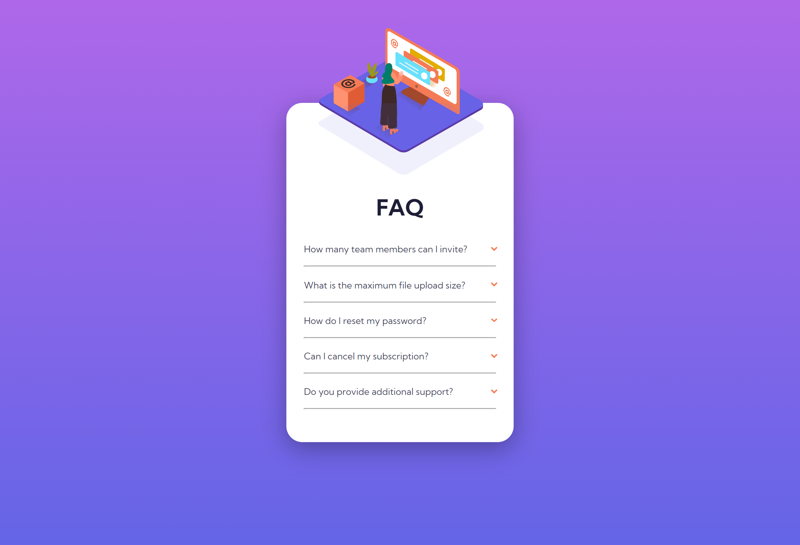

# Frontend Mentor - FAQ accordion card solution

This is a solution to the [FAQ accordion card challenge on Frontend Mentor](https://www.frontendmentor.io/challenges/faq-accordion-card-XlyjD0Oam). Frontend Mentor challenges help you improve your coding skills by building realistic projects.

## Table of contents

- [Overview](#overview)
  - [The challenge](#the-challenge)
  - [Screenshot](#screenshot)
  - [Links](#links)
- [My process](#my-process)
  - [Built with](#built-with)
- [Author](#author)

## Overview

### The challenge

Users should be able to:

- See hover states for all interactive elements on the page
- Hide/Show the answer to a question when the question is clicked

### Screenshot

### Links

- Solution URL: [https://www.frontendmentor.io/solutions/faq-accordion-card-only-mobile-screens-gAaxIH5QvS](https://www.frontendmentor.io/solutions/faq-accordion-card-only-mobile-screens-gAaxIH5QvS)
- Live Site URL: [https://github.com/Rock-n-Roll-CRC/faq-accordion-card](https://github.com/Rock-n-Roll-CRC/faq-accordion-card)

## My process

### Built with

- Semantic HTML5 markup
- Flexbox
- Mobile-first workflow

## Author

- Frontend Mentor - [Danil_Dikhtyar 🔥](https://www.frontendmentor.io/profile/Rock-n-Roll-CRC)
- Twitter - [@Rock_n_Roll_CRC](https://twitter.com/Rock_n_Roll_CRC)
- Discord - Rock_n_Roll_CRC#2944
